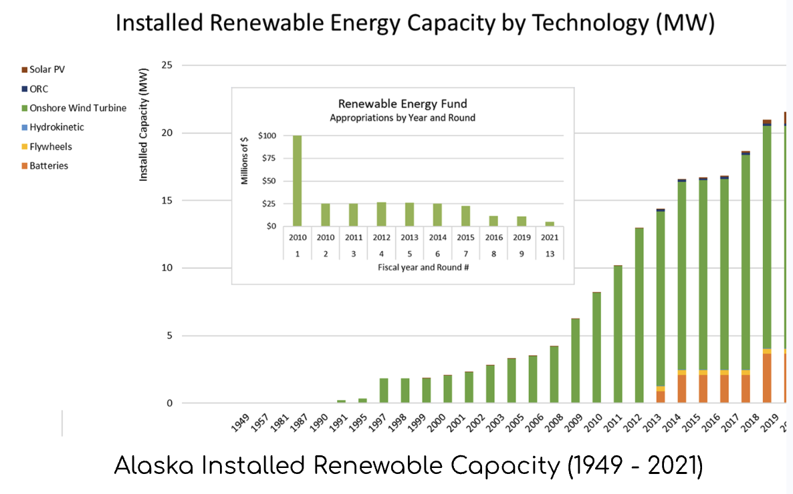
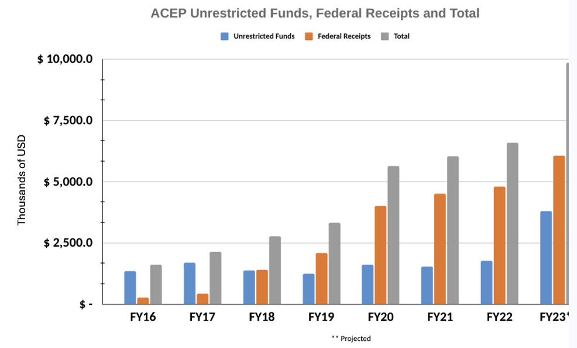
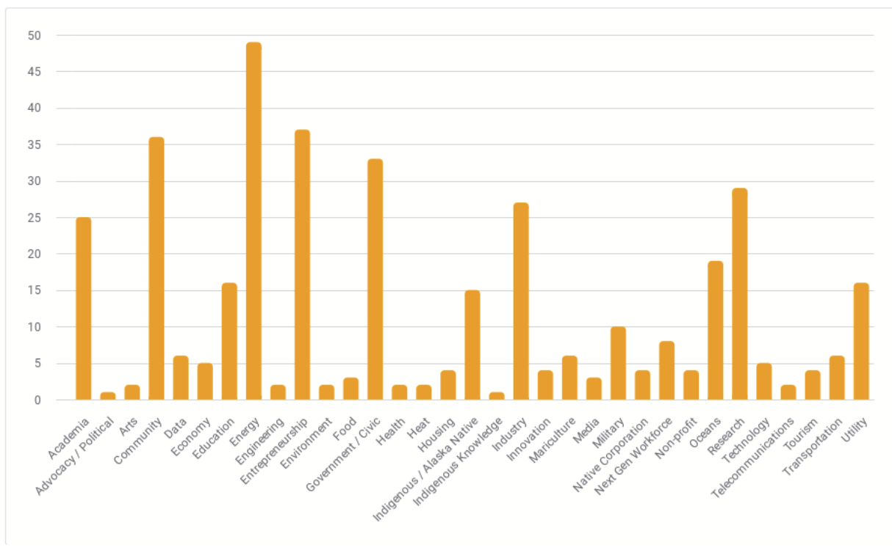

+++
title = "Alaska Regional Collaboration for Innovation and Commercialization Program"
layout = "about"
description = "AN OFFICE OF NAVAL RESEARCH INITIATIVE"
heroUpperTitle = "ARCTIC"
heroBackgroundImage = "images/CRREL_site_tour-1.jpg"
onrLogo = "images/logos/ONR-logo.png"
onrLogoAlt = "Office of Naval Research Logo"
disclaimer = "The project or effort undertaken was or is sponsored by the Department of the Navy, Office of Naval Research under ONR award number(s) N00014-19-1-2235, N00014-22-1-2049, N00014-24-1-2675. Any opinions, findings, conclusions, or recommendations expressed in this material are those of the author(s) and do not necessarily reflect the views of the Office of Naval Research."
+++

Established in 2017, the ARCTIC program is an Office of Naval Research initiative designed to help Alaskan organizations and communities develop a thriving innovation ecosystem through energy resiliency research, technology development/deployment, and education. ARCTIC leverages and augments existing capacity and accelerates the energy transition in Alaska and the North, while also building key partnerships between Alaska and the Arctic and Pacific regions.

Our vision for capacity building under the ARCTIC program centers on sustainable, cost-effective energy solutions implemented with the following principles:

1. Research and technology development is community-led and addresses local, self-identified economic needs;
2. Alaskans are leaders and key partners in U.S. research and innovation
3. Alaskan communities and small businesses thrive through economic diversification and development

### Objectives

ARCTIC program activities are funded across a number of ONR grants awarded to the partner organizations, which are augmented by complementary funding from the state and the private sector. The specific program objectives have evolved over time as progress towards the initial goals has been made and new partners have been identified.

The objectives for ARCTIC III are as follows:

- Demonstrate the economic and technical feasibility of innovative and site-appropriate energy solutions for the Arctic and beyond.
- Enhance local sustainability by extending and leveraging local know-how and leadership for energy transition challenges.
- Support the diversification of Alaska’s innovation ecosystem through enhanced capacity and whole-of-community engagement.
- Demonstrate that high penetrations of variable renewable energy on microgrids is both technically and economically feasible as well as broadly replicable.

### Capacity Building Success and Challenges



    

        
The ARCTIC program has been invaluable for building capacity and stimulating dynamic growth within the state of Alaska. During the past five years, we have seen the number of communities that can achieve high penetration, diesel off-operation expanded 
from three to over a dozen. The total installed capacity across all renewable energy technologies has also steadily increased despite reductions in state funding. Much of this results from increased know-how and capacity at the state and local levels, meaning these projects are being developed, operated, and maintained successfully.

    

    

        
    





    

        
    

    

        
Increased capacity at ACEP has mirrored increased installed renewable capacity across the state. ACEP’s rising profile as a leading source of energy research expertise within the state, nation, and internationally has resulted in a 500% increase in base funding from the State of Alaska. This has allowed ACEP to expand faculty and research staffing and to be increasingly successful in securing competitive research funding from the Dept. of Energy and the National Science Foundation, along with supporting the success of our community partners with their community-led efforts. ACEP and ARCTIC program partners across the state are working to seed new ideas, expand early-stage initiatives, and sustain successful, proven capacity-building efforts with the end goal of moving our research from the lab to the real world. To achieve this, ARCTIC leadership is designing a program that intentionally and continually stimulates capacity development while pushing the envelope on what is technically and economically feasible.

    



### Program Members and Partners



    

        
The number of ARCTIC program partners has grown substantially over the past five years and currently includes over 200 partners across various sectors (see Figure 1). However, the core leadership team is comprised of five organizations, three of which are within the University of Alaska (UA) system: the Alaska Center for Energy and Power (ACEP), the Center for Innovation, Commercialization, and Entrepreneurship (Center ICE), and the University of Alaska Anchorage Center for Economic Development (CED). The two external partner organizations are Renewable Energy Alaska Project (REAP) and Launch Alaska.

    

    

        
    



### National & Department of Defense (DoD) Relevance
The Alaska Regional Collaboration for Technology Innovation and Commercialization (ARCTIC) program is an Office of Naval Research (ONR) funded capacity-building program established in 2017, designed to support the Navy’s needs for public-private partnerships that promote commerce and collaboration between Alaska and the Arctic and Pacific regions, centered on energy systems and resiliency research.

The program is designed to help Alaskan organizations and communities develop a thriving innovation ecosystem through energy resiliency research, technology development and deployment, and education. It leverages partnerships and builds capacity across networks to accelerate the energy transition in Alaska and the North, while also fostering key collaborations between Alaska and the Arctic and Pacific regions. 

It is intended to directly support the U.S., Department of Defense (DoD), and Navy’s strategic goals for Alaska and the Arctic. Specifically, it aims to build local capacity in Alaska to improve and boost the state's ability to support increased domain awareness and enhance operational abilities for **military(?)** forces within Alaska and the Arctic region. This is accomplished by enhancing the capacity and resilience of local infrastructure and connected workforce. 

The **ARCTIC** program is highlighted in the Navy’s 2021 *Blue Arctic* strategy as an example of their investment in building public-private partnerships and innovative solutions. These efforts aim to transform operating abilities and regional understanding for Naval forces.
